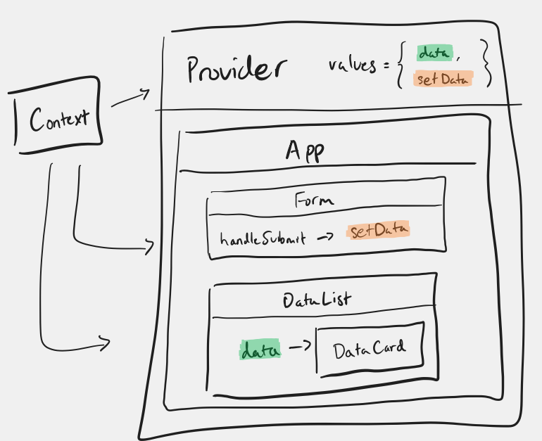

# React Router + Context

**Table of Contents**:
- [Overall Flow](#overall-flow)
- [Context:](#context)
  - [Examples](#examples)
- [React Router:](#react-router)
  - [Examples](#examples-1)

## Overall Flow

Context:
* The ContextProvider manages state and provides it to the App
* The App and its child components use that the context to render the current state.
* When the ContextProvider fetches new data, the App is re-rendered
* The App components (a form, for example) can get the state-setter from context and update the state



Routing + Products:
* The user visits `/products`
* The `Routes` component reacts, rendering the `Products` component
* The `Products` page pulls the products from context and renders a list of `Link` components for each product
* The user clicks on the fifth product link, taking them to `/products/5`
* The `Routes` component reacts, rendering the `Product` component
* The `Product` page pulls the products from Context, finds the product whose ID matches the path parameter `id`, and renders the found product (or a fallback).

## Context:

* `Context` is the "glue" that connects the "Provider" with the "Consumer"
* `Context.Provider` manages state and determines the context values
  * `useState` to create shared state values
  * If you want to fetch: `useEffect` to fetch on render and set the state
* `useContext` gets ("consumes") the Context values in child components

### Examples

The `ProductsContextProvider` creates the `products` state, renders the `ProductsContext.Provider` to provide the `products` state through the `contextValues` object, and fetches data from the API to update that state.

```jsx
import { useEffect, useState } from "react";
import ProductsContext from "./ProductsContext"
import fetchData from '../utils/fetchData';

const ProductsContextProvider = ({ children }) => {
  const [products, setProducts] = useState([])
  const [error, setError] = useState(null);

  useEffect(() => {
    const doFetch = async () => {
      const [data, error] = await fetchData('https://dummyjson.com/products')
      if (data) setProducts(data.products);
      if (error) setError(error);
    }
    doFetch();
  }, [])

  const contextValues = { products, error }

  return (
    <ProductsContext.Provider value={contextValues}>
      {children}
    </ProductsContext.Provider>
  )
}

export default ProductsContextProvider
```

The `Products` component uses the context value `products` to render a `<Link>` for each product.

```jsx
import { Link } from "react-router-dom";
import ProductsContext from "../context/ProductsContext";
import { useContext } from "react";

const Products = () => {

  // use destructuring to get the products
  const { products } = useContext(ProductsContext);

  // Use the products to render a list of links 
  return (
    <>
      <h1>Products</h1>
      <ul>
        {
          products.map((product) => {
            return (
              <li>
                <Link to={`/products/${product.id}`}>
                  {product.title}
                </Link>
              </li>
            )
          })
        }
      </ul >
    </>
  )
}

export default Products;
```

## React Router:

* `Link`s provide navigation ("take me to `/about`") 
* `Routes`/`Route` respond to changes in navigation ("I'm at `/about`, show me the `<About />` component")
* Path parameters allows the URL to communicate which resource is being displayed:
  * `/products/:id` lets the user navigate to a URL like `/products/4` to communicate that they want the product with the `id` of 4
* `useParams()` returns an object with key:value pairs for the path parameters present in the current URL

### Examples

A `main.jsx` file that uses both a BrowserRouter and context:
```jsx
import { BrowserRouter } from 'react-router-dom'
import ProductsContextProvider from './context/ProductsContextProvider.jsx'

ReactDOM.createRoot(document.getElementById('root')).render(
  <BrowserRouter >
    <ProductsContextProvider>
      <App />
    </ProductsContextProvider>
  </BrowserRouter >
)
```

The `App` component defines the routes. The `NavBar` component is rendered regardless of the current browser location (the current URL).

```jsx
function App() {
  return (
    <>
      <NavBar />
      <main>
        <Routes>
          <Route path='/' element={<Dashboard />} />
          <Route path='/about' element={<About />} />
          <Route path='/contacts' element={<Contacts />} />
          <Route path='/products' element={<Products />} />
          <Route path='/products/:id' element={<Product />} />
          <Route path='*' element={<NotFound />} />
        </Routes>
      </main>
      <footer></footer>
    </>
  )
}
```

The `NavBar` component has `Link` components that can take the user to another page without causing the page to reload or fetch a new resource:

```jsx
import { Link } from "react-router-dom";

const NavBar = () => {
  return (<nav>
    <ul>
      <li><Link to='/'>Dashboard</Link></li>
      <li><Link to='/about'>About</Link></li>
      <li><Link to='/contacts'>Contacts</Link></li>
      <li><Link to='/products'>Products</Link></li>
      <li><Link to='https://www.reddit.com/'>Reddit</Link></li>
    </ul>
  </nav>
  )
}
```

The `Product` component is rendered for the path `'/products/:id'` where `id` is the path parameter. The component uses `useParams` to get the `params.id` value. It also pulls `products` data from the context and uses the `params.id` value to find the matching product and render its data (or a fallback message).

```jsx
import { useParams, Navigate, Link } from "react-router-dom";
import ProductsContext from "../context/ProductsContext";
import { useContext } from "react";

const Product = () => {
  const contextValues = useContext(ProductsContext);
  
  // If the URL is `/products/3` then `params.id` is `"3"`
  const params = useParams();

  const product = contextValues.products.find((product) => product.id === Number(params.id))

  if (!product) return (
    <>
      <p>product not found</p>
      <Link to='/'>Go Home</Link>
    </>
  )

  return (
    <>
      <h1>{product.title}</h1>
      <p>{product.description}</p>
      <p>{product.price}</p>
      <p>Rating: {product.rating}</p>
      
    </>
  )
}

export default Product;
```